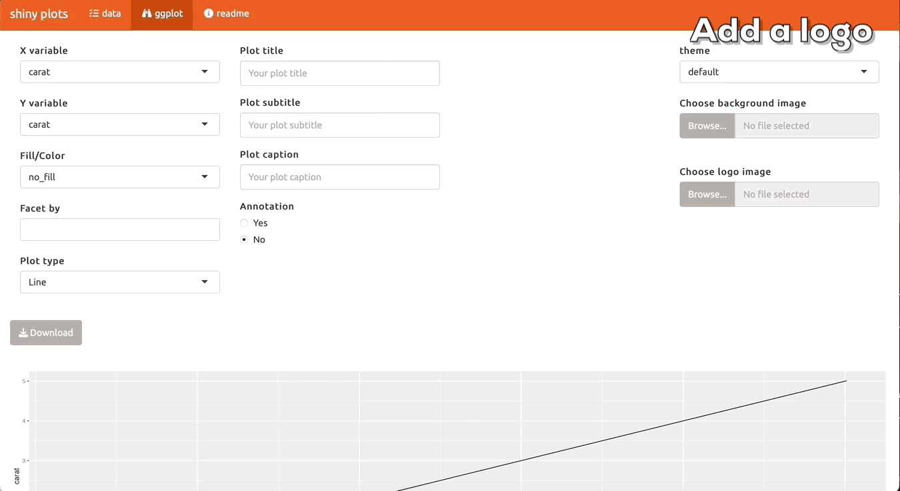

# shiny_plots

Data visualization is a good way to understand datasets and the need to utilze this has expanded beyond just technical users. With the Data Visualization Shiny App, technical users can create interactive charts very quickly with copiable code, while non-technical users can generate visualizations using drop-down functionality.

Key Features:

+ Ability to upload your own file and create a ggplot with drop-down manual.
+ Ability to add logo and/or background.
+ Ability to add annotation at mouse click. 
+ Code display for both technical and non-technical users.

See the following example uses:

1. Create a scatter plot:

2. Add multiple annotation with different color with mouse click:

3. Add a logo to the plot:

