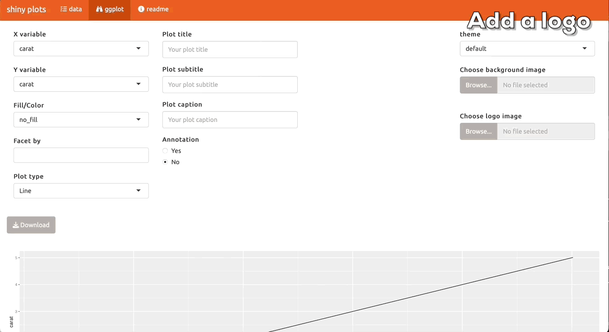

# 📊 Shiny Plot Studio

[](https://tiger-tang.shinyapps.io/shiny_plots/) 
[](https://tigertang.org/shinyapps_for_everyone/)

**Shiny Plot Studio** is a productivity tool designed to bridge the gap between technical and non-technical users. It allows anyone to create publication-ready `ggplot2` visualizations via a GUI, while simultaneously generating the underlying R code for reproducibility and learning.

---

## 🔥 Key Capabilities

**Zero-Code Visualization:** Upload datasets and generate complex plots using intuitive dropdown menus—no R knowledge required.   
**Meta-Programming (Code Export):** Automatically generates the exact `ggplot2` R code used to create the plot. Perfect for "copy-paste" reproducibility in reports.   
**Custom Branding:** Integrated engine to add organizational logos or background watermarks to plots.   
**Dynamic Annotations:** Point-and-click interface to add real-time text annotations directly on the canvas.   
**Flexible Layouts:** Instantly toggle between different plot types and professional themes.

## 🛠️ Technical Highlights

**Reactive Data Handling:** Uses `renderUI` to adapt the interface to the specific columns and data types of any uploaded dataset.   
**Stringified Logic:** Implements reactive logic to capture user inputs and translate them into clean, human-readable R scripts.   
**Coordinate Mapping:** Uses Shiny's `plot_click` coordinates to programmatically place annotations within the `ggplot2` coordinate system.   

## 🚀 Getting Started

To run this application locally, ensure you have R installed and run the following in your console:

```r
# Install core dependencies
install.packages(c("shiny", "ggplot2", "shinyjs", "grid"))

# Run the app directly from GitHub
shiny::runGitHub("shiny_plots", "CodingTigerTang")
```

## 🧠 Motivation

In many organizations, the ability to visualize data is restricted by technical barriers. This project was born from a simple goal: Automate the boring stuff. By providing a GUI that outputs code, this app serves as a "bridge" for new R adopters to learn syntax while still being immediately productive.

**For Non-Technical Users**: High-quality plots without writing a single line of code.   
**For R Beginners**: A "bridge" to learn ggplot2 syntax by observing generated code.   
**For Pros**: Turns a manual 30-minute plotting task into a 30-second configuration.   

"Data visualization is a good way to understand datasets... the need to utilize this has expanded beyond just technical users." [— Read the full breakdown on my blog](https://tigertang.org/shinyapps_for_everyone/)

## Example Uses:

1. Create a scatter plot:


2. Add multiple annotation with different color with mouse click:


3. Add a logo to the plot:


